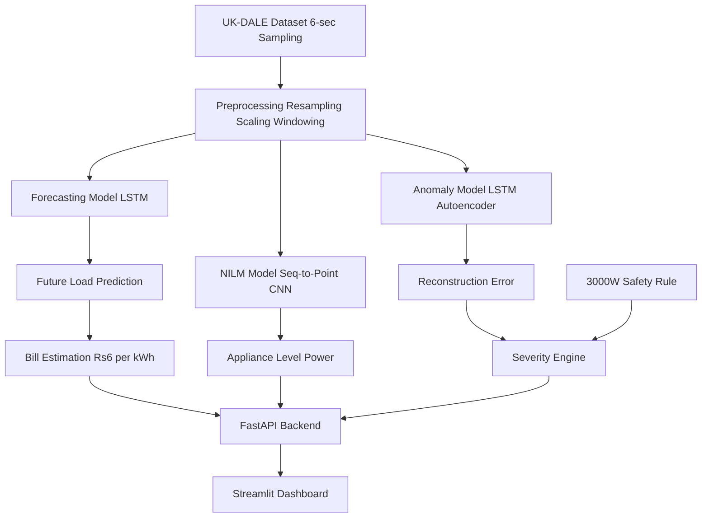

# ⚡ IntelliWatt – AI-Powered Smart Energy Analytics System

A complete deep learning–based smart energy monitoring platform built on the **UK-DALE dataset**, integrating:

- 🔌 NILM (Seq-to-Point CNN)
- 🔌 NILM (Seq-to-Seq CNN)
- 🔌 NILM (BiGRU – Bidirectional Gated Recurrent Unit)
- 📈 LSTM Load Forecasting
- 🚨 Hybrid Anomaly Detection (LSTM Autoencoder + Safety Rule)
- 💰 Monthly Bill Estimation
- ⚙ FastAPI Backend
- 📊 Streamlit Dashboard

---

## 🏗 System Architecture


```mermaid
flowchart TD

    A[UK-DALE Dataset 6-sec Sampling]
    B[Preprocessing Resampling Scaling Windowing]

    C1[NILM Model Seq-to-Point CNN]
    C2[Forecasting Model LSTM]
    C3[Anomaly Model LSTM Autoencoder]

    D1[Appliance Level Power]
    D2[Future Load Prediction]
    D3[Reconstruction Error]

    E[3000W Safety Rule]
    F[Severity Engine]

    G[Bill Estimation Rs6 per kWh]
    H[FastAPI Backend]
    I[Streamlit Dashboard]

    A --> B
    B --> C1
    B --> C2
    B --> C3

    C1 --> D1
    C2 --> D2
    C3 --> D3

    D3 --> F
    E --> F

    D2 --> G
    G --> H
    D1 --> H
    F --> H

    H --> I
```

---

## 🔄 System Flow

```
UK-DALE data
  └─► Preprocessing & Alignment (resampling, scaling, windowing)
        └─► Task-Specific Training Datasets
              ├─► NILM (Seq-to-Point CNN / Seq-to-Seq CNN / BiGRU)
              ├─► Load Forecasting (LSTM)
              └─► Anomaly Detection (LSTM Autoencoder)
                    └─► Trained Models & Scalers
                          └─► FastAPI Endpoints (/predict_nilm, /forecast, /detect_anomaly, /estimate_bill)
                                └─► Streamlit Dashboard (interactive visualization & alerts)
```

---

## 📂 Project Structure

```bash
IntelliWatt/
│
├── data/
│
├── src/
│   ├── preprocessing/
│   ├── models/
│   │   ├── nilm/
│   │   ├── forecasting/
│   │   └── anomaly/
│   ├── training/
│   └── evaluation/
│
├── backend/
│   └── app.py
│
├── frontend/
│   └── streamlit_app.py
│
├── saved_models/
│
└── requirements.txt
```

---

## 🔬 Core Models

### 🔌 1. NILM – Seq-to-Point CNN

- Window size: **599**
- Sampling rate: **6 seconds**
- Center-point prediction — maps an input window of aggregate power to a **single point** (center value) of appliance power
- Individual models:
  - fridge
  - kettle
  - microwave
  - washing_machine

**Goal:** Disaggregate aggregate mains power into appliance-level consumption.

---

### 🔌 1b. NILM – Seq-to-Seq CNN

- Window size: **599**
- Sampling rate: **6 seconds**
- **Sequence-to-sequence mapping** — maps an entire input window of aggregate power to a **full output sequence** of appliance power of the same length
- Uses 1D convolutional layers with appropriate padding to preserve temporal resolution
- Produces denser supervision signals compared to Seq-to-Point, enabling the model to learn finer temporal patterns
- Individual model:
  - fridge

**Goal:** Provide appliance-level disaggregation with full-sequence output for richer temporal detail.

---

### 🔌 1c. NILM – BiGRU (Bidirectional GRU)

- Window size: **599**
- Sampling rate: **6 seconds**
- Uses **Bidirectional Gated Recurrent Units** to capture both past and future context in the aggregate signal
- Processes the input sequence in both forward and backward directions, then merges the hidden states
- Better suited for capturing long-range temporal dependencies compared to purely convolutional approaches
- Individual model:
  - fridge

**Goal:** Leverage recurrent bi-directional context for more accurate appliance-level energy disaggregation.

---

### 📈 2. Forecasting – LSTM

- Window size: **60**
- 6-second sampling
- 1-step ahead prediction

Used for:
- Short-term load forecasting
- Monthly bill estimation

---

### 🚨 3. Hybrid Anomaly Detection

#### LSTM Autoencoder

- Trained on normal sequences
- Uses reconstruction MSE

Threshold formula:

```python
threshold = mean_error + 2 * std_error
```

Current metrics:

```json
{
    "threshold": 0.4723,
    "mean_error": 0.0562,
    "std_error": 0.2080
}
```

#### Safety Rule

```python
if total_power > 3000:
    severity = "severe"
```

#### Severity Logic

| Condition | Severity |
|-----------|----------|
| error < threshold | normal |
| threshold < error < 2×threshold | mild |
| error > 2×threshold | severe |
| power > 3000W | severe |

---

## 💰 Monthly Bill Estimation

Assumption: **₹6 per kWh**

```python
Energy (kWh) = sum(power * 6 seconds) / 3600
Bill = Energy × 6
```

Uses forecasted load to estimate projected monthly cost.

---

## ⚙ Backend – FastAPI

Handles:

- Model loading  
- Scaling  
- Inference  
- Hybrid anomaly logic  
- Bill estimation  
- JSON API responses  

### Example Endpoints

| Endpoint | Description |
|----------|-------------|
| `/predict_nilm` | Appliance disaggregation |
| `/forecast` | Load prediction |
| `/estimate_bill` | Monthly cost estimate |
| `/detect_anomaly` | Hybrid anomaly detection |
| `/metrics` | Model evaluation metrics |

Run backend:

```bash
uvicorn backend.app:app --reload
```

---

## 📊 Frontend – Streamlit Dashboard

Features:

- Real-time power graph  
- Appliance-level breakdown  
- Forecast visualization  
- Monthly bill estimate  
- Anomaly alerts (color-coded severity)  

Run frontend:

```bash
streamlit run frontend/streamlit_app.py
```

---

## 🧠 AI Techniques Used

- Convolutional Neural Networks (CNN) — Seq-to-Point & Seq-to-Seq
- Bidirectional Gated Recurrent Units (BiGRU)
- Long Short-Term Memory (LSTM)
- LSTM Autoencoder (Unsupervised)
- Hybrid Rule-Based + Deep Learning Detection

---

## 🚀 Key Features

✔ Appliance-level energy disaggregation  
✔ Short-term load forecasting  
✔ Hybrid anomaly detection  
✔ Monthly bill estimation  
✔ Modular architecture  
✔ Production-ready REST API  
✔ Interactive dashboard  

---

## 📊 Dataset

Trained on:

**UK-DALE (UK Domestic Appliance-Level Electricity)**

- 6-second resolution  
- Real household appliance-level data  

---

## 🎯 Future Enhancements

- Real-time IoT integration  
- Dynamic tariff pricing  
- Solar prediction integration  
- Multi-home scalability  
- Docker + Cloud deployment  
- Edge-device inference  

---

## 🏆 Project Summary

IntelliWatt is a hybrid deep-learning energy analytics platform that combines NILM-based appliance disaggregation, LSTM forecasting, autoencoder-based anomaly detection, and bill estimation into a production-ready FastAPI + Streamlit system trained on 6-second UK-DALE data.